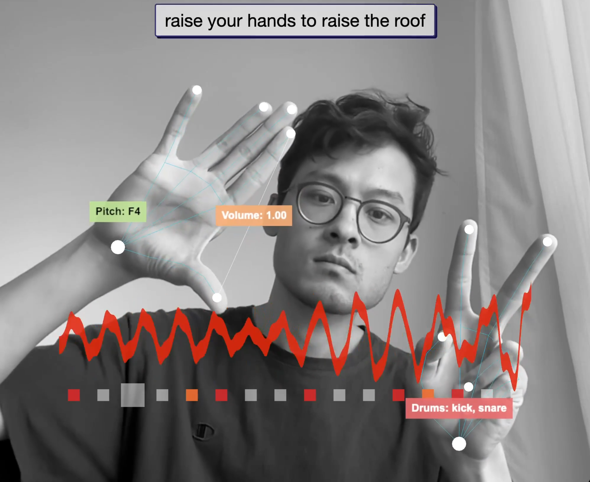

# 🎵 Arpeggiator Remix - 手势控制音乐创作系统

一个基于手势识别的实时音乐创作工具，支持左右手协同控制琶音与鼓机。

## ✨ 功能特色

- **实时手势识别**：使用 MediaPipe 进行精确的手部跟踪
- **双手控制**：左手控制琶音（音高、音量、音色），右手控制鼓机节拍
- **自定义编辑器**：可视化编辑琶音模式和鼓组节拍
- **实时波形显示**：可视化音频输出
- **预设管理**：内置多种音乐风格预设

## 🎮 操作指南

### 左手控制（琶音）
- **手掌高度**：控制音高（上高下低）
- **拇指与食指捏合**：控制音量（捏紧音量小，张开音量大）
- **握拳**：切换音色预设

### 右手控制（鼓机）
- **手指伸展**：不同手指对应不同鼓点（食指=踢鼓，中指=军鼓，无名指=踩镲，小指=拍手）
- **4指紧贴**：4个手指（食指、中指、无名指、小指）伸直并紧贴，切换琶音风格
- **握拳**：切换鼓组预设

## 🎛️ 自定义编辑器功能测试

### 琶音编辑器测试
1. 点击右下角的"自定义编辑器"按钮
2. 选择"编辑琶音"
3. **音符选择**：点击音符按钮来选择琶音中要使用的音符
4. **和弦间隔**：设置和弦的音程间隔
5. **琶音模式**：选择上行、下行或上下行模式
6. **速度控制**：调整琶音播放速度
7. 点击"预览"测试效果
8. 点击"应用"将设置应用到实时演奏中

### 鼓组编辑器测试
1. 在自定义编辑器中选择"编辑鼓组"
2. **16步音序器**：
   - Kick（踢鼓）：点击对应步骤来激活/关闭
   - Snare（军鼓）：设置军鼓的节拍模式
   - Hi-hat（踩镲）：创建踩镲节奏
   - Clap（拍手）：添加拍手音效
3. 使用快速操作：
   - **清空所有**：一键清除所有鼓点
   - **随机化**：自动生成随机节拍模式
4. 点击"应用"将鼓组模式应用到实时演奏

### 预设保存测试
1. 在编辑器中创建自定义设置
2. 点击"保存预设"
3. 输入预设名称
4. 预设将保存到本地存储，下次访问时自动加载

## 🔧 技术架构

- **前端**：HTML5, CSS3, JavaScript (ES6+)
- **音频引擎**：Tone.js
- **手势识别**：MediaPipe
- **3D 可视化**：Three.js
- **实时处理**：Web Audio API

## 🚀 启动方式

1. 使用 Live Server 或任何本地服务器启动项目
2. 允许摄像头访问权限
3. 将手放在摄像头前开始创作音乐

## ⚠️ 注意事项

- 需要良好的光线条件以确保手势识别准确性
- 建议使用支持 WebRTC 的现代浏览器
- 首次使用需要一些时间来熟悉手势控制

## 🐛 故障排除

### 手势识别不流畅
- 检查光线是否充足
- 确保手部在摄像头视野内
- 尝试调整手部与摄像头的距离

### 音频延迟
- 使用有线耳机减少音频延迟
- 关闭其他占用音频资源的应用

### 自定义编辑器无响应
- 确保游戏已完全加载
- 检查浏览器控制台是否有错误信息
- 刷新页面重试

## 📝 更新日志

### v1.2.0 (最新)
- ✅ 修复初始化错误
- ✅ 优化手势识别平滑度
- ✅ 解决通知显示重叠问题
- ✅ 完善自定义编辑器功能
- ✅ 增强错误处理机制

### v1.1.0
- 🆕 添加自定义编辑器
- 🆕 支持预设保存/加载
- 🔧 优化性能

### v1.0.0
- 🎉 基础手势控制功能
- 🎵 琶音与鼓机系统
- 📊 实时波形显示

---

**享受你的音乐创作之旅！** 🎶

# Hand Gesture Arpeggiator

Hand-controlled arpeggiator, drum machine, and audio reactive visualizer. Raise your hands to raise the roof!

An interactive web app built with threejs, mediapipe computer vision, rosebud AI, and tone.js.

- Hand #1 controls the arpeggios (raise hand to raise pitch, pinch to change volume)
- Hand #2 controls the drums (raise different fingers to change the pattern)

[Video](https://youtu.be/JepIs-DTBgk?si=4Y-FrQDF6KNy662C) | [Live Demo](https://collidingscopes.github.io/arpeggiator/) | [More Code & Tutorials](https://funwithcomputervision.com/)



## Requirements

- Modern web browser with WebGL support
- Camera access enabled for hand tracking

## Technologies

- **MediaPipe** for hand tracking and gesture recognition
- **Three.js** for audio reactive visual rendering
- **Tone.js** for synthesizer sounds
- **HTML5 Canvas** for visual feedback
- **JavaScript** for real-time interaction

## Setup for Development

```bash
# Clone this repository
git clone https://github.com/collidingScopes/arpeggiator

# Navigate to the project directory
cd arpeggiator

# Serve with your preferred method (example using Python)
python -m http.server
```

Then navigate to `http://localhost:8000` in your browser.

## License

MIT License

## Credits

- Three.js - https://threejs.org/
- MediaPipe - https://mediapipe.dev/
- Rosebud AI - https://rosebud.ai/
- Tone.js - https://tonejs.github.io/

## Related Projects

I've released several computer vision projects (with code + tutorials) here:
[Fun With Computer Vision](https://www.funwithcomputervision.com/)

You can purchase lifetime access and receive the full project files and tutorials. I'm adding more content regularly 🪬

You might also like some of my other open source projects:

- [3D Model Playground](https://collidingScopes.github.io/3d-model-playground) - control 3D models with voice and hand gestures
- [Threejs hand tracking tutorial](https://collidingScopes.github.io/threejs-handtracking-101) - Basic hand tracking setup with threejs and MediaPipe computer vision
- [Particular Drift](https://collidingScopes.github.io/particular-drift) - Turn photos into flowing particle animations
- [Video-to-ASCII](https://collidingScopes.github.io/ascii) - Convert videos into ASCII pixel art

## Contact

- Instagram: [@stereo.drift](https://www.instagram.com/stereo.drift/)
- Twitter/X: [@measure_plan](https://x.com/measure_plan)
- Email: [stereodriftvisuals@gmail.com](mailto:stereodriftvisuals@gmail.com)
- GitHub: [collidingScopes](https://github.com/collidingScopes)

## Donations

If you found this tool useful, feel free to buy me a coffee. 

My name is Alan, and I enjoy building open source software for computer vision, games, and more. This would be much appreciated during late-night coding sessions!

[](https://www.buymeacoffee.com/stereoDrift)