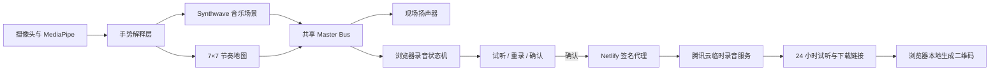
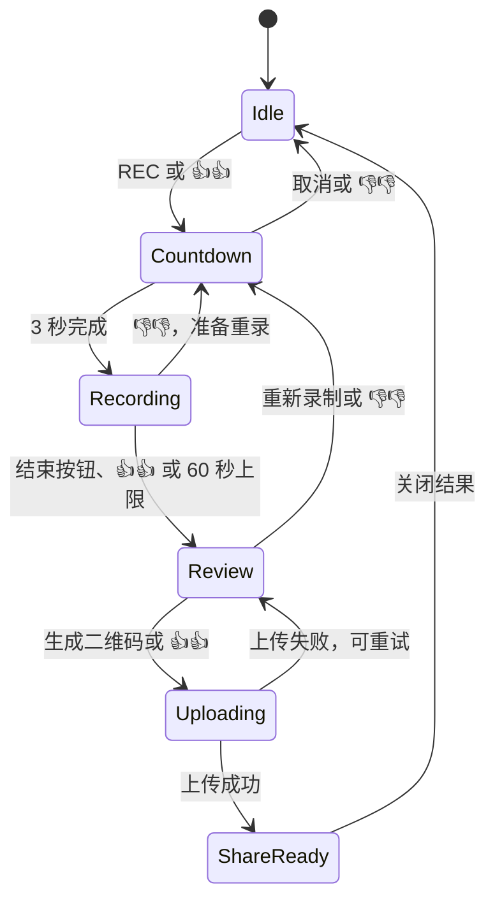

# Arpeggiator Remix Exhibition V2 设计规格

**状态：** 已由用户逐节确认，等待用户审阅书面规格
**日期：** 2026-07-10
**开发分支：** `feature/exhibition-v2`
**隔离目录：** `D:\Codex\arpeggiator-remix-exhibition-v2`
**生产站点：** `https://arpeggiator-remix-2.netlify.app/`

## 1. 目标

在不破坏邀请码保护、现有实时手势演奏和现场稳定性的前提下，将项目升级为适合公开展示的数字乐器：提供一分钟网页内部混音录音、双手手势控制、云端临时分享二维码、二维鼓组空间、Synthwave 音乐场景、简洁指引，以及更艺术化的复古未来 UI。

所有功能先在测试分支和 Netlify 分支预览中完成。只有用户明确验收后，才允许替换生产主站内容。

## 2. 非目标

- 本轮不实现网页内部录屏。现场录屏先使用 OBS 或操作系统录屏。
- 不合并、不修改 `feature/duo-mix-mode`。
- 不做人脸识别、参与者身份识别、身体追踪或复杂的多人控制权锁定。
- 不在浏览器运行 MusicVAE 或其他新增机器学习模型。
- 不要求现场电脑安装软件、修改下载目录或持久保存录音。
- 不购买域名；首版使用免费 HTTPS 服务器入口和现有 Netlify 主站域名。
- 不在未评估影响的情况下执行 `npm audit fix` 或进行无关依赖升级。

## 3. 安全基线与隔离策略

- 测试分支从受保护的 `origin/main` 创建，基线提交为 `59f9ef3`。
- 原始 OneDrive 工作区保持不变，不清理、不切换分支、不覆盖其中的未提交内容。
- 当前邀请码 Edge Function、认证 Cookie、`robots.txt` 与 `X-Robots-Tag` 行为必须回归通过。
- 每个开发批次先生成独立预览部署；生产主站不自动更新。
- 出现严重回归时直接回滚到最后一个通过验收的预览提交。

## 4. 总体架构



前端保持静态站点形态。新增逻辑拆成边界明确的模块：共享音频总线、录音控制器、录音 UI、双手录音手势、节奏地图、音乐场景、指引卡片和分享客户端。云服务器使用独立轻量服务，不复用或污染播客转写虚拟环境。

## 5. 页面瘦身与编辑器移除

琶音编辑器和鼓组编辑器从运行时产品中移除：

- 删除两个编辑器入口、弹窗、相关状态展示和暂停/恢复绑定。
- `main.js` 不再导入或实例化 `CustomEditor`、`ArpeggioEditor`。
- 首轮不物理删除编辑器源文件，避免误删当前历史成果；它们不再被浏览器加载。
- 保留核心音乐预设、鼓组播放、音量和场景切换能力。
- 移除仅供编辑器使用的全局 Tone.js 脚本，核心统一使用同一个 Tone.js 模块与音频上下文。
- 删除 `raise your hands to raise the roof` 的默认文本及所有恢复该文本的回调；保留空的 `aria-live` 状态区域用于错误、录音和上传提示。

## 6. 复古未来 UI

视觉方向为“克制的复古未来合成器仪器”：

- 深黑与石墨灰为底色，电青、紫红、暖橙作为功能色，录音统一使用红色。
- 使用细线网格、示波器刻度和少量霓虹光晕，不使用持续的大面积模糊或高成本滤镜。
- 中文使用清晰的系统中文字体；英文标签使用几何或等宽风格。正式 UI 不依赖 emoji。
- 左手信息为电青，右手节奏为紫红或暖橙。
- 动画只使用 `transform` 与 `opacity`；简化模式和 `prefers-reduced-motion` 下关闭非必要动画。

布局：

- 左上：圆形 `REC` 按钮和录音计时。
- 顶部中央：`SCENE / SYNTH / RHYTHM / BPM` 精简状态条。
- 右上：动作指引、简化模式和设置入口。
- 左下：GitHub 与小红书线性图标。
- 底部中央：场景选择与少量必要操作。
- Delay、鼓轨音量和录音手势开关进入默认折叠的 `CONTROL DECK`。
- 中央长期保持空净，仅用于手势骨架、波形、节奏光标、录音倒计时及统一浮层。

社交链接固定为：

- GitHub：`https://github.com/Electro-Dig`
- 小红书：`https://www.xiaohongshu.com/user/profile/6070457c000000000101efac`

链接在新标签页打开，并使用 `rel="noopener noreferrer"`。

## 7. 动作指引

指引不自动出现，也没有“下一位”或强制会话概念。现场操作者通过右上角“动作指引”按钮随时从第一张重新展示。

三张卡片：

1. **站位提示：** 当前参与者靠近摄像头并站在画面中央，尽量只让其双手进入画面；旁观者不要在摄像头范围内举手。
2. **音乐操作：** 左手控制旋律、滤波和音量；右手位置控制节奏，五根手指控制鼓轨。
3. **录音操作：** 双手拇指向上表示开始、结束或确认；双手拇指向下表示取消或重录，具体含义由当前状态决定。

交互规则：

- 固定提供“上一张”“下一张”“跳过指引”按钮，不要求完成任何识别任务。
- 模型已就绪时，双手拇指向上稳定 0.8 秒也可以关闭整套指引。
- 指引打开时暂停录音状态手势，但不重新加载摄像头、模型或音乐设置。
- 关闭指引后，必须先松开手势并保持中性状态 1 秒，才重新启用录音手势。
- 正在录音、停止处理中或上传中时禁用“动作指引”按钮。

不增加中央互动框、掌宽阈值、参与者锁定、跳跃冻结或逐卡动作验证。人群干扰主要通过卡片提示、摄像头朝向、参与者靠近和现场站位管理解决。

## 8. 左右手稳定性

- 使用 MediaPipe 返回的 handedness 分配左手与右手职责，不再依赖检测数组顺序。
- 显示镜像与模型 handedness 的映射在单一函数内处理并测试。
- 手部短暂丢失时停止对应琶音或清空活跃鼓轨，避免卡音。
- 不引入人脸、身体或额外手部模型。

## 9. 共享音频总线

音乐和鼓组都连接到共享 Master Bus：

```text
Arpeggio + Bass + Drums
        -> Master Gain
        -> Limiter
        -> Analyser
        -> Tone Destination / Speakers
        -> MediaStreamAudioDestinationNode / Recorder
```

- Master Bus 是最终混音唯一出口，录音内容与现场听到的输出一致。
- 不录制摄像头麦克风，也不请求音频输入权限。
- Analyser 继续服务现有波形视觉。
- 合成器、鼓组和录音共用同一 Tone.js 上下文。
- 未录音时不创建 MediaRecorder，不运行录音计时器，也不进行文件编码工作。

## 10. 录音格式与限制

- 优先顺序：`audio/mp4`/M4A、`audio/webm;codecs=opus`、`audio/webm`、`audio/ogg;codecs=opus`、`audio/ogg`。
- 必须通过 `MediaRecorder.isTypeSupported()` 选择浏览器真实支持的格式，不把 WebM 数据伪装成 WAV。
- 目标音频码率为 128 kbps；浏览器忽略该选项时接受浏览器默认值。
- 单次录音最长 60 秒，3 秒倒计时后开始。
- 录音中显示红点、已用时间和 60 秒进度；达到上限自动停止并进入试听。
- 云端文件上限为 5 MB，允许的 MIME 类型仅为 M4A/MP4、WebM/Opus 和 OGG/Opus。
- 浏览器内最多保留当前 take 与上一 take 两份 Blob；新 take 成功结束后才替换上一份，降低误操作丢失风险。

## 11. 录音状态机



规则：

- 任何手势操作都有等价、清晰的屏幕按钮。
- 停止录音不会自动上传，必须在试听界面确认。
- 试听界面提供播放、生成二维码、重新录制和“下载到本机”次级按钮。
- 默认不向借用电脑写入文件；只有主动点击下载时才触发浏览器下载。
- 上传失败时保留 Blob，允许重试、重录或手动下载。
- 关闭页面后，尚未上传且未手动下载的数据自然消失。
- `ShareReady` 阶段禁用录音手势，二维码不会自动关闭。

## 12. 双手录音手势

仅保留两种状态相关手势：

| 当前状态 | 双手拇指向上 | 双手拇指向下 |
|---|---|---|
| 待机 | 进入倒计时 | 无操作 |
| 倒计时 | 无操作 | 取消 |
| 录音中 | 提前结束并试听 | 结束并准备重录 |
| 试听确认 | 上传并生成二维码 | 重新录制 |
| 上传 / 二维码 | 禁用 | 禁用 |

识别标准：

- 两只手同时可见；两只拇指方向一致，其余四指收拢。
- 条件持续 0.8 秒才触发，并显示可见的识别进度。
- 任一手丢失或姿势不满足时，进度归零。
- 每次触发后必须松开并保持中性姿势 1 秒才重新武装。
- 候选与触发期间，录音手势层优先于音乐手势层，避免同时切换音色或鼓组。
- `CONTROL DECK` 提供“录音手势”开关；人群干扰严重时可关闭，仅保留屏幕按钮。

## 13. 云服务器与二维码

### 13.1 公开路径

- 二维码指向现有主站：`https://arpeggiator-remix-2.netlify.app/r/<token>`。
- `<token>` 使用至少 128 位安全随机数并采用 URL-safe 编码。
- 分享页面提供在线试听、下载按钮和明确的到期时间。
- 不提供录音列表、搜索、用户账户或参与者姓名字段。
- 分享页设置 `noindex, nofollow, noarchive`。

### 13.2 Netlify 边界

- 上传使用同源路径 `/recordings-api/upload`，继续经过邀请码 Edge Function；未认证访问不能上传。
- `/r/<token>` 是邀请码保护的唯一公开例外，只能读取一个随机 token 对应的录音。
- Netlify external proxy 为发往云服务器的请求添加签名 `x-nf-sign`。
- 代理密钥只存在于 Netlify 环境变量与云服务器环境变量，不写进客户端或 Git。

### 13.3 腾讯云服务

- 服务器：现有 Ubuntu 腾讯云实例，约 2C/2GB。
- 免费入口：`43-159-132-70.sslip.io`，通过 Caddy 自动 HTTPS。
- 服务目录：`/srv/arpeggiator-recordings`，与 `/home/ubuntu/podcast-knowledge` 隔离。
- 轻量 Node.js 服务只接收原始音频 Blob、验证 Netlify 签名、写入文件、返回 token，并提供带过期检查的读取接口。
- 服务不转码、不分析音频、不调用 Whisper。
- 允许的请求体最大 5 MB；拒绝不支持的 MIME、空文件和无效签名。
- 每段录音保存音频文件和最小元数据：token、MIME、扩展名、创建时间、到期时间、字节数。
- 录音保留 24 小时。读取过期 token 时删除数据并返回 410；systemd timer 定期清理未被访问的过期数据。
- 服务器不记录参与者身份或录音标题，仅保留安全与错误所需的最小日志。

### 13.4 二维码

- QR 在浏览器本地生成，不调用第三方二维码服务。
- QR 库按需加载；只有上传成功后才实例化。
- QR 内容只包含主站分享 URL，不包含服务器 IP、密钥或内部路径。

## 14. 二维鼓组空间

使用静态、确定性的 7×7 节奏地图：

- X 轴：左侧规整/四拍，右侧切分/跳跃。
- Y 轴：上方稀疏/留白，下方密集/高能量。
- 49 个格子都对应固定的 16 步、5 鼓轨节奏；数据在开发期生成和人工筛选后随站点发布。
- 运行时不随机生成、不运行神经网络。
- 右手掌位置选择候选格；小范围平滑与格子滞回只用于防止手抖。
- 新节奏在下一小节边界生效，不在小节中间替换。
- 五根手指继续实时控制 Open-hat、Kick、Snare、Hi-hat、Clap 是否参与。
- 取消右手 Y 对 Note Length 的控制；Note Length 由当前音乐场景决定，并在 `CONTROL DECK` 保留人工调整。
- 取消右手握拳切换固定鼓组；握拳自然表示所有鼓轨关闭。
- 地图视觉只在当前格子变化时更新 DOM/Canvas 状态，不进入高成本 Three.js 重建循环。

## 15. Synthwave 音乐场景

新增三个完整场景，并保留现有音乐为 Classic 组：

| 场景 | 调式 | BPM | 主要性格 |
|---|---|---:|---|
| Neon Drive | E Natural Minor | 120 | 失谐锯齿琶音、Chorus、节拍 Delay，作为默认 |
| Midnight Pulse | E Harmonic Minor | 108 | 暗色脉冲、短音符、更多休止与低音强调 |
| Arcade Horizon | A Dorian | 126 | 明亮 Pluck、八度跳跃、宽立体声延迟 |

控制与声音结构：

- 左手 Y 在当前调式内量化根音，不再直接使用完整半音阶。
- 左手 X 控制共享滤波器截止频率，从暗到亮连续变化。
- 左手拇指与食指距离继续控制演奏音量。
- 左手握拳继续切换当前场景内的音色变体。
- 左手四指手势继续循环场景。
- 每个场景共同定义调式、BPM、琶音序列、休止、音长、低音规则和效果参数。
- 声部上限为主琶音与轻量单音低音两条；不增加自动和弦伴奏。
- 效果节点复用，手移动时只更新参数，不重建合成器或效果链。
- 场景 BPM 是全局 Transport BPM；二维鼓组位置不改变 BPM。

## 16. 错误与降级

- `MediaRecorder` 不支持：禁用 REC 并显示浏览器兼容提示，音乐功能保持可用。
- 摄像头拒绝或不可用：保留现有错误引导，不进入录音手势识别；屏幕录音按钮仅在音频引擎可用时工作。
- 云服务器或网络不可用：返回试听界面，保留 Blob，提供重试和手动下载。
- 上传超时：取消当前网络请求但不销毁 Blob。
- 文件过大或 MIME 无效：服务器拒绝，前端显示明确原因。
- 分享 token 不存在：返回 404；已过期：返回 410 和“录音已过期”页面。
- QR 库加载失败：仍显示可复制的分享链接。
- 手势误触环境：操作者可以关闭录音手势，不影响音乐演奏与屏幕按钮。

## 17. 性能约束

- 未录音时没有 MediaRecorder、录音计时器或二维码运行负担。
- 未显示指引时，指引 DOM 与动画不运行。
- 节奏格只在格子改变时更新，节奏应用只在小节边界发生。
- Synthwave 效果节点共享，最多两条合成声部。
- 音频录制使用压缩格式，不在浏览器转 WAV。
- 相对基线，待机和录音状态的手势追踪中位 FPS 回退不得超过 10%。
- 进行 30 分钟连续演奏测试和 10 分钟重复录音/试听/重录循环，不能出现持续内存增长、音频卡死或明显爆音。

## 18. 测试与验收

### 自动测试

- 邀请码 token、Cookie、重定向与公开分享路径。
- 录音 MIME 选择、文件名、60 秒自动停止、取消、重录、重试与状态转换。
- 双手手势 0.8 秒保持、1 秒重新武装、丢手重置和禁用开关。
- handedness 映射和手丢失后的音频清理。
- 7×7 格子选择、滞回、下一小节提交与五指鼓轨遮罩。
- Synthwave 调式量化、场景 BPM、场景切换与 Master Bus 路由。
- 服务器签名验证、大小/MIME 限制、随机 token、24 小时过期与清理。

### 浏览器与现场测试

- Windows Chrome/Edge：摄像头、音频启动、M4A/WebM 录音、试听和上传。
- iOS Safari 与 Android Chrome：扫码、试听和下载分享页。
- 断网、慢网、服务器停机、上传中断和重复点击。
- 邀请码未认证时上传必须被拒绝；随机分享页无需邀请码但只能读取对应录音。
- 多人背景环境下观察误触；需要时关闭录音手势验证屏幕按钮完整可用。
- 30 分钟现场式连续运行，检查 CPU、内存、帧率、音频延迟与恢复能力。

## 19. 分批交付

1. **界面瘦身：** 移除编辑器运行入口、旧文案，加入社交链接、指引卡与复古未来 UI。
2. **浏览器录音：** Master Bus、60 秒录音、状态机、试听、双手手势与本机下载兜底。
3. **云端分享：** 腾讯云服务、免费 HTTPS、Netlify 签名代理、24 小时分享页与二维码。
4. **二维鼓组：** 7×7 节奏地图、下一小节切换、五指鼓轨遮罩和旧映射移除。
5. **Synthwave：** 三个新场景、调式量化、滤波、主琶音与轻量低音层。

每一批都必须通过自动测试、浏览器 smoke 和独立 Netlify 预览后才进入下一批。最终生产发布必须再次获得用户明确授权。
